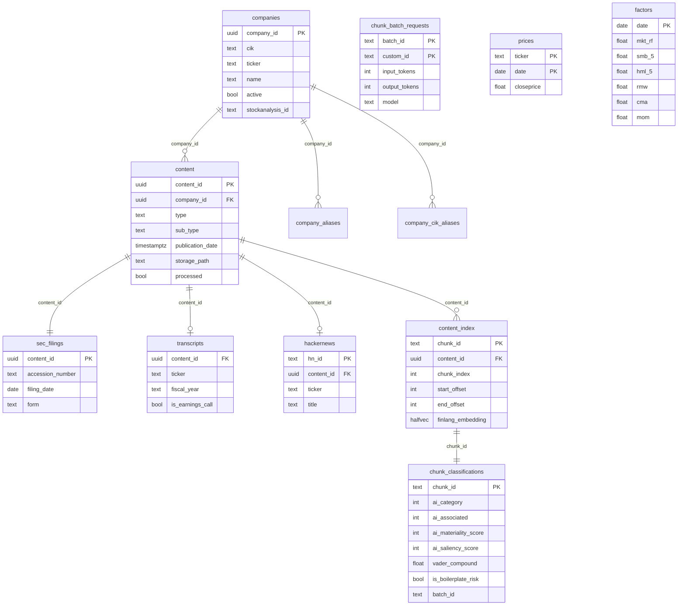

# AI Engagement & Factor Model

Isolates each company's real exposure to AI — first from what it *says* (SEC
filings, earnings calls, HackerNews mentions, LLM-classified), then from what
the *market* actually prices (a Fama-French-style factor model) — across 9
companies: ADBE, CAT, DELL, INTC, MU, NVDA, PG, TEAM, WM.

## Stack

- **Postgres via Supabase**, with the `pgvector` extension (`sql/0007_content_index.sql`)
  for embedding-based retrieval. Schema lives in `sql/`, applied in order
  (`0001_...` → `0013_...`).
- **Raw document text is not stored in Postgres or in this repo.** Chunk rows
  only carry `start_offset`/`end_offset` into a markdown file sitting in
  Supabase Storage (`shared/storage.py`); text is sliced out on demand.
- **Embeddings**: `FinLang/finance-embeddings-investopedia` (a financial-domain
  embedding model) generates 768-dim vectors per chunk, used for the
  dynamic-retrieval first pass and the content-search tool in `frontend/`.
- **LLM classification runs on an Anthropic API subscription**, not chat —
  two stages, two different models, picked for cost/latency vs. judgment:
  - **Stage 1** (`classification/*/LLM_Filtering.py`): Haiku 4.5, cheap dynamic
    RAG classification — is this chunk AI-relevant at all, and how.
  - **Stage 2** (`classification/second_pass/`): Sonnet 5, the more expensive
    materiality (1-10) + valence (-3 to +3) scoring, run only on what Stage 1
    kept. Uses the Batch API and prompt caching (company context + content
    type + instructions are cached, not re-sent per chunk) to keep cost down.
- **Market data / factor modeling**: `yfinance` for prices and ETF holdings,
  Kenneth French's daily Fama-French factors, `statsmodels` for OLS/rolling
  regressions — entirely separate from the LLM pipeline above, deliberately
  (see `factor_model/`).

## Schema



`chunk_classifications.chunk_id` -> `content_index.chunk_id` -> `content.content_id`
-> `companies.company_id` is the whole join chain behind every score used in
`signal_generation/` and `factor_model/`. `prices`/`factors` are independent,
joined only by `(ticker, date)` when building the factor model — never
through the classification tables, which is exactly what keeps the two
signals in this repo (text-derived vs. market-derived) from being circular.

## Layout

```
sql/                   Postgres schema (companies, content, content_index w/ pgvector,
                        chunk_classifications, prices, factors, ...)
shared/                 DB connection, EDGAR client, Supabase Storage helpers, ticker/CIK aliasing
pipelines/              Ingestion entrypoints: universe load, SEC filings, transcripts,
                        HackerNews, prices, Fama-French factors (run_all.py drives them)
classification/         The 2-stage LLM classification itself:
  sec/, transcripts/, news/    Stage 1 (Haiku) dynamic-RAG filtering + prompts, per content type
  second_pass/, second_pass_prompts/   Stage 2 (Sonnet) materiality/valence scoring + prompts
  boilerplate_check/           Flags repeated SEC risk-factor boilerplate so it doesn't
                                inflate materiality scores
  golden_second_pass.py/.csv   Hand-labeled eval set for the second pass
signal_generation/      Turns classified chunks into rolling per-ticker signals
                        (raw_materiality, raw_sentiment = materiality x valence) —
                        build_signals.py + the interactive report generators
factor_model/           The separate market-based AI factor model: per-company AI beta
                        via Fama-French + sector-controlled regression, orthogonalized
                        (Frisch-Waugh-Lovell) against multicollinearity. ai_factor_walkthrough.ipynb
                        steps through it cell by cell.
frontend/               Flask app (app.py) — pgvector similarity search over all classified
                        content, for eyeballing what the LLM actually saw
appendix/               The numbered static HTML reports (data sources, RAG methodology,
                        valence proof, sentiment signal, token efficiency, factor construction)
Slides/, notebooks/     Exploratory charts and scratch notebooks
data/universe.csv       The 9-ticker universe definition
```

## What this actually is

1. **Ingest** SEC filings (10-K/10-Q/20-F + material 8-Ks), earnings-call
   transcripts, and HackerNews mentions for the 9-company universe, chunked
   and embedded.
2. **Classify, two stages**: Haiku does cheap dynamic-RAG triage (AI-relevant
   or not, and which category); Sonnet scores materiality and valence on
   whatever survives, batched and prompt-cached to control cost.
3. **Build a signal**: roll those per-chunk scores up into a per-ticker,
   per-date AI Sentiment Score, z-scored against a fixed pre-2023 baseline so
   it keeps climbing as a company genuinely diverges from "pre-boom normal"
   rather than mechanically compressing as peers catch up.
4. **Build an independent, market-based check**: in `factor_model/`, regress
   each company's actual stock return on Fama-French controls + sector +
   an AI factor (two constructions: an ex-universe hardware+platform basket,
   and the ARTY thematic ETF), orthogonalized so the AI beta isn't secretly a
   tech or momentum bet. Deliberately price-based, not text-derived, so it
   can be compared against the Stage 1-3 signal without circularity.
5. **Compare the two** (`7_Sentiment_vs_Factor.html`): does what a company
   says about AI line up with what the market actually prices in?
